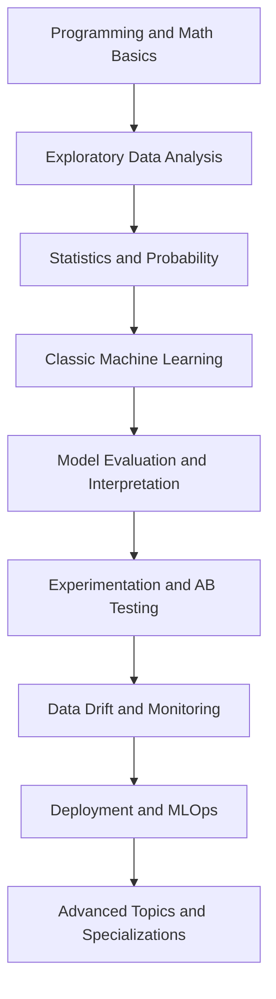

```mermaid
graph TD
    A["Programming and Math Basics"] --> B["Exploratory Data Analysis"]
    B --> C["Statistics and Probability"]
    C --> D["Classic Machine Learning"]
    D --> E["Model Evaluation and Interpretation"]
    E --> F["Experimentation and AB Testing"]
    F --> G["Data Drift and Monitoring"]
    G --> H["Deployment and MLOps"]
    H --> I["Advanced Topics and Specializations"]
```
